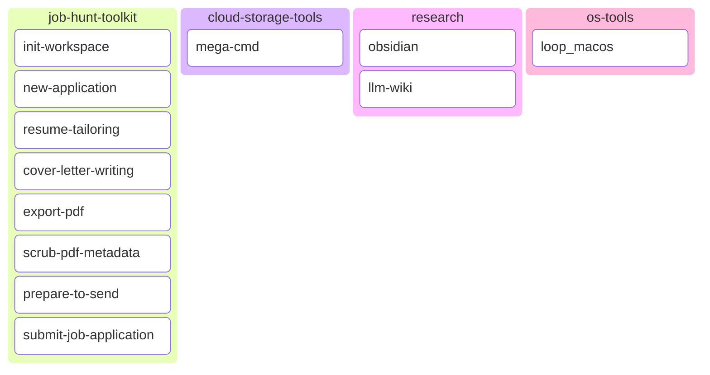
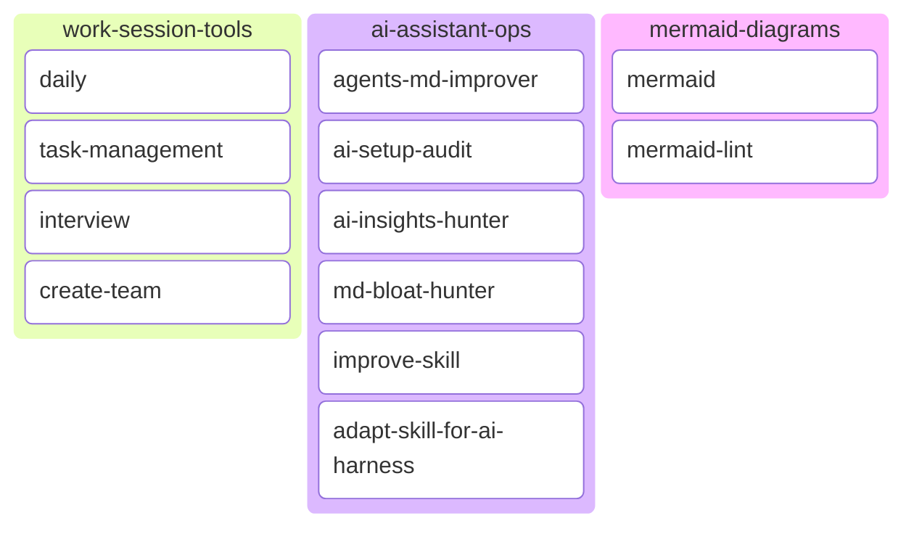
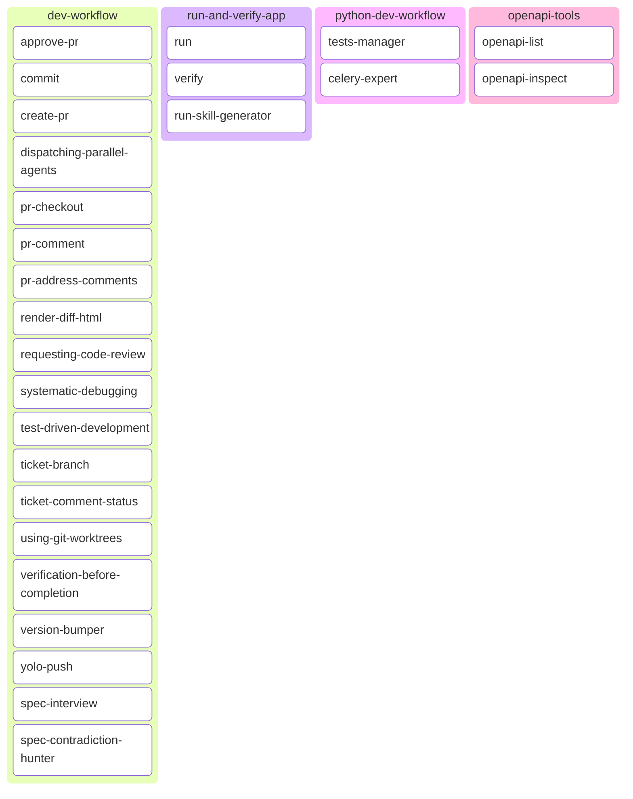
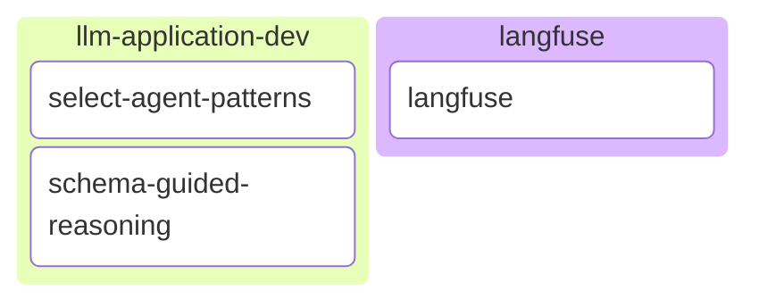

# 🗡️ Zweihander

Mercado simple, robusto y versátil para plugins de agentes,
forjado para el caos del mundo de la IA.

Recopila herramientas prácticas para Codex y Claude Code en áreas como observabilidad de LLM,
exploración de APIs, flujos de trabajo de desarrollo, operaciones de asistencias, notas de investigación,
almacenamiento en la nube, automatización local, verificación de aplicaciones en tiempo de ejecución y flujos de
búsqueda de empleo.

## Acerca de

Actualmente trabajo en herramientas de orquestación de IA y me esfuerzo por mantenerme a la vanguardia.

Estoy abierto a nuevas oportunidades en ingeniería de IA, aplicaciones de LLM y herramientas para desarrolladores.

[✉️ Envíame un correo](mailto:alexkopylov123@gmail.com)

## Proyectos Destacados

- [Zweihander](https://github.com/Alex-Kopylov/zweihander) — un mercado de plugins para agentes compatible con Codex y Claude Code.
- [AI-Ready Modern Python Template](https://github.com/Alex-Kopylov/ai-ready-modern-python-template) — un punto de partida práctico para proyectos de Python preparados para IA.
- [GH Babysitter](https://github.com/Alex-Kopylov/gh-babysitter) — automatización de flujos de trabajo en GitHub para mantener el trabajo en marcha.


## Catálogo de Plugins

### Productividad General para Usuarios



### Productividad General para Usuarios de IA



### Programación



### Ingeniero de IA



## Notas para Usuarios

Usa este README cuando quieras instalar el mercado, instalar un plugin o
seleccionar para qué sirve cada plugin. Las notas para desarrolladores y mantenimiento se encuentran en
`AGENTS.md`.

Las notificaciones de procedencia y licencias de terceros se encuentran en
`third_party/`.

## Instalación Rápida

### Codex

Añade el mercado:

```shell
codex plugin marketplace add Alex-Kopylov/zweihander
```

Instala un plugin:

```shell
codex plugin add langfuse@zweihander
```

Lista los plugins disponibles:

```shell
codex plugin list
```

Actualiza el mercado instalado:

```shell
codex plugin marketplace upgrade zweihander
```

### Claude Code

Añade el mercado desde dentro de Claude Code:

```shell
/plugin marketplace add Alex-Kopylov/zweihander
```

Instala un plugin:

```shell
/plugin install langfuse@zweihander
```

Actualiza el mercado instalado:

```shell
/plugin marketplace update zweihander
```

Para scripts o automatización, usa la CLI no interactiva:

```shell
claude plugin marketplace add Alex-Kopylov/zweihander
claude plugin install langfuse@zweihander
claude plugin marketplace update zweihander
```

## Cómo Usarlo

1. Añade este mercado a Codex o Claude Code.
2. Elige un plugin del catálogo a continuación.
3. Instala el plugin con `plugin@zweihander`, por ejemplo
   `langfuse@zweihander`.
4. Pídele al asistente de forma natural el flujo de trabajo que deseas. El plugin instalado
   aportará habilidades, agentes o ambos.

## Plugins

### `langfuse`

**Usar cuando:** necesites inspeccionar datos de Langfuse, crear o actualizar activos de evaluación
activos, comparar ejecuciones de experimentos o gestionar widgets del panel.

**Habilidades**

| Habilidad | Descripción |
|---|---|
| `langfuse` | Habilidad unificada de Langfuse para descubrimiento de datos, métricas, conjuntos de datos, ejecuciones de experimentos, evaluadores, widgets del panel y gestión del panel. Los flujos de trabajo específicos de tarea anteriores se incluyen como referencias internas. |

**Agentes**

| Agente | Descripción |
|---|---|
| `langfuse-data-explorer` | Descubrimiento de solo lectura para puntuaciones, trazas, modelos y métricas. |
| `langfuse-dataset-expert` | Creación de conjuntos de datos, gestión de elementos y diseño de esquemas. |
| `langfuse-eval-manager` | CRUD de evaluadores, filtros y gestión de estados. |
| `langfuse-experiment-manager` | Ejecuciones de experimentos, análisis, comparación y webhooks. |
| `langfuse-widget-manager` | Creación, actualización y sugerencias para paneles y widgets. |

### `openapi-tools`

**Usar cuando:** tengas un servicio API en ejecución y quieras que el asistente descubra
los endpoints disponibles o inspeccione los detalles de las operaciones.

**Habilidades**

| Habilidad | Descripción |
|---|---|
| `openapi-list` | Lista las rutas OpenAPI disponibles. |
| `openapi-inspect` | Inspecciona las entradas, salidas y detalles del esquema de los endpoints. |

### `llm-application-dev`

<details>
<summary>Diseño de aplicaciones LLM, selección de patrones de agentes y patrones de razonamiento guiado por esquema.</summary>

**Usar cuando:** necesites elegir patrones de flujo de trabajo LLM, comparar
compromisos de arquitectura de agentes o diseñar esquemas estructurados que guíen al
modelo en su razonamiento.

**Habilidades**

| Habilidad | Descripción |
|---|---|
| `select-agent-patterns` | Elige patrones de flujo de trabajo y diseño de agentes LLM descomponiendo un problema en etapas y comparando candidatos. Basado en [Un marco bidimensional para patrones de diseño de agentes de IA](https://arxiv.org/pdf/2605.13850). |
| `schema-guided-reasoning` | Diseña esquemas Pydantic estructurados que guíen el razonamiento del LLM. |

**Agentes de Habilidad**

| Habilidad | Agente | Descripción |
|---|---|---|
| `select-agent-patterns` | `pattern-fit-reviewer` | Revisa de forma independiente un patrón candidato para una etapa del flujo de trabajo. |

</details>

### `python-dev-workflow`

**Usar cuando:** estés derivando escenarios a partir de requisitos, escribiendo o revisando
pruebas de Python, decidiendo cobertura E2E vs integración vs unitaria, probando comportamiento de Celery o
Redis, o configurando Celery para entornos de producción.

**Habilidades**

| Habilidad | Descripción |
|---|---|
| `celery-expert` | Configura tareas, trabajadores, reintentos, programaciones, rendimiento y seguridad de Celery. |
| `tests-manager` | Planifica escenarios y escribe pruebas E2E, de integración y unitarias con pytest, usando referencias focalizadas. |

**Agentes**

| Agente | Descripción |
|---|---|
| `integration-test-writer` | Escribe pruebas de integración para endpoints y cableado real. |
| `test-scenario-planner` | Deriva escenarios vinculados a requisitos y casos extremos antes de enrutamiento de cobertura. |
| `test-runner` | Ejecuta comandos focalizados de pytest o `uv run pytest`. |
| `test-unit-reviewer` | Revisa pruebas unitarias en cuanto a calidad, cobertura y patrones. |
| `unit-test-writer` | Escribe pruebas unitarias focalizadas con mocks, fixtures y fábricas. |

### `dev-workflow`

**Usar cuando:** necesites soporte para flujos de trabajo de desarrollo estructurados: TDD, depuración,
informes de diffs visuales, revisión, commits, PRs, ramas de tickets, actualizaciones de estado,
actualización de versiones o verificación de especificaciones.

**Nota de origen:** varias habilidades metodológicas de este plugin fueron copiadas del
proyecto [Superpowers](https://github.com/obra/superpowers) licenciado bajo MIT de
Jesse Vincent. Consulta `third_party/THIRD_PARTY_NOTICES.md` para la procedencia
habilidad por habilidad.

**Habilidades**

| Habilidad | Descripción |
|---|---|
| `approve-pr` | Aprueba y fusiona PRs con las verificaciones actuales y controles de política. |
| `commit` | Crea Commits Convencionales en una sola línea. |
| `create-pr` | Abre solicitudes de extracción (PRs) desde la rama actual. |
| `dispatching-parallel-agents` | Coordina tareas de subagentes independientes que pueden ejecutarse concurrentemente. |
| `pr-address-comments` | Obtiene, corrige, responde y resuelve comentarios de PRs. |
| `pr-checkout` | Cambia a una rama de PR para revisión o cambios. |
| `pr-comment` | Publica comentarios generales o en línea en PRs. |
| `render-diff-html` | Renderiza diffs de git y comparaciones de archivos como informes HTML. |
| `requesting-code-review` | Solicita una revisión focalizada antes de completar la tarea o fusionar. |
| `spec-contradiction-hunter` | Encuentra contradicciones e inconsistencias en especificaciones. |
| `spec-interview` | Entrevista al usuario y genera una especificación de implementación. |
| `systematic-debugging` | Investiga errores mediante evidencias, patrones, hipótesis y correcciones. |
| `test-driven-development` | Aplica el ciclo rojo-verde-refactorización para funciones, correcciones de errores y cambios de comportamiento. |
| `ticket-branch` | Crea una rama de git a partir de un ID o URL de ticket. |
| `ticket-comment-status` | Publica actualizaciones de estado en tickets o elementos de trabajo. |
| `using-git-worktrees` | Configura ramas de espacio de trabajo aisladas para trabajo en funciones. |
| `verification-before-completion` | Verifica afirmaciones antes de informar el trabajo como completo o corregido. |
| `version-bumper` | Actualiza versiones en metadatos de plugins y paquetes. |
| `yolo-push` | Flujo de trabajo de commit, PR, CI, merge y CD activado por comando de barra. |

**Agentes**

| Agente | Descripción |
|---|---|
| `ambiguity-contradiction-hunter` | Encuentra contradicciones ocultas derivadas de lenguaje ambiguo. |
| `release-manager` | Coordina flujos de trabajo de actualización de versión y commits. |
| `structural-contradiction-hunter` | Encuentra conflictos lógicos y de alcance más profundos. |
| `surface-contradiction-hunter` | Encuentra contradicciones directas y explícitas. |

### `run-and-verify-app`

<details>
<summary>Lanzamiento, verificación y generación de habilidades de ejecución de aplicaciones en tiempo de ejecución, inspirado en Claude Code.</summary>

**Usar cuando:** quieras lanzar una aplicación, verificar un cambio contra la
aplicación en ejecución en lugar de solo pruebas, o registrar una receta de compilación y lanzamiento reutilizable
para un proyecto.

Inspirado en el flujo de trabajo integrado de ejecución y verificación de aplicaciones de Claude Code, este plugin
lleva tres habilidades coordinadas a Codex. Es exclusivo para Codex; los usuarios de Claude Code
pueden usar las habilidades integradas de ejecución y verificación de Claude Code.

Esta es una adaptación con opiniones propias, no una traducción directa. Refleja las preferencias de este
mercado por evidencias en tiempo de ejecución y habilidades de ejecución de proyecto reutilizables.

| Habilidad | Propósito |
|---|---|
| `run` | Lanza e impulsa tu aplicación para ver un cambio en funcionamiento. |
| `verify` | Compila y ejecuta tu aplicación para confirmar que un cambio de código hace lo que debe, sin recurrir a pruebas o verificaciones de tipo. |
| `run-skill-generator` | Enseña a `run` y `verify` cómo compilar y lanzar tu proyecto registrando una receta verificada y específica del proyecto. |

</details>

### `mermaid-diagrams`

Genera y valida diagramas Mermaid con referencias de sintaxis sincronizadas.

**Usar cuando:** quieras crear diagramas Mermaid a partir de requisitos o validar
bloques de código Mermaid con la CLI de Mermaid.

**Habilidades**

| Habilidad | Descripción |
|---|---|
| `mermaid` | Genera diagramas Mermaid a partir de requisitos del usuario con referencias de sintaxis locales. |
| `mermaid-lint` | Valida bloques de código Mermaid con `mmdc` e informa el estado de lint y errores. |

### `work-session-tools`

**Usar cuando:** quieras notas diarias, seguimiento de tareas, entrevistas estructuradas o un
equipo multiagente diseñado para una sesión de trabajo más extensa.

**Habilidades**

| Habilidad | Descripción |
|---|---|
| `create-team` | Diseña un equipo multiagente y un plan de transición. |
| `daily` | Genera una nota diaria a partir de la actividad del proyecto. |
| `interview` | Recorre una lista de elementos uno por uno. |
| `task-management` | Rastrea, divide y orquesta tareas de la sesión. |

### `research`

<details>
<summary>Flujos de trabajo de wiki de investigación y bóvedas de Obsidian para notas mantenidas por agentes.</summary>

**Usar cuando:** quieras crear o consultar una wiki de investigación interconectada, ingestar
fuentes en una base de conocimientos, verificar la salud de la wiki o trabajar con notas de Obsidian.

**Origen:** adapta habilidades licenciadas bajo MIT de
[NousResearch/hermes-agent](https://github.com/NousResearch/hermes-agent):
[`llm-wiki`](https://raw.githubusercontent.com/NousResearch/hermes-agent/refs/heads/main/skills/research/llm-wiki/SKILL.md)
y
[`obsidian`](https://raw.githubusercontent.com/NousResearch/hermes-agent/refs/heads/main/skills/note-taking/obsidian/SKILL.md).

**Habilidades**

| Habilidad | Descripción |
|---|---|
| `llm-wiki` | Construye, consulta, ingestara en y verifica una wiki de investigación en Markdown interconectada, inspirada en el patrón LLM Wiki de Andrej Karpathy. |
| `obsidian` | Lee, busca, crea, añade y edita notas en una bóveda de Obsidian con enfoque en el sistema de archivos. |

</details>

### `ai-assistant-ops`

**Usar cuando:** quieras auditar instrucciones del asistente, mejorar archivos AGENTS.md,
mejorar habilidades existentes, adaptar habilidades para orquestadores de asistencias, capturar
puntos clave de sesión o reducir la redundancia en Markdown.

**Habilidades**

| Habilidad | Descripción |
|---|---|
| `adapt-skill-for-ai-harness` | Adapta habilidades explícitamente nombradas usando una matriz de acciones JSON del asistente y referencias de orquestador específicas del objetivo. |
| `agents-md-improver` | Audita y mejora los archivos AGENTS.md del repositorio. |
| `ai-insights-hunter` | Extrae decisiones, patrones y preferencias reutilizables de una sesión. |
| `ai-setup-audit` | Audita archivos de configuración del asistente en busca de conflictos y redundancia. |
| `improve-skill` | Mejora habilidades existentes mediante retroalimentación de evaluación, comparación con línea base, iteración y verificación de disparadores. |
| `md-bloat-hunter` | Recorta redundancia, verbosidad y palabras de relleno en Markdown. |

**Agentes de Habilidad**

| Habilidad | Agente | Descripción |
|---|---|---|
| `ai-insights-hunter` | `decisions-hunter` | Extrae decisiones duraderas de una conversación. |
| `ai-insights-hunter` | `patterns-hunter` | Encuentra patrones de flujo de trabajo e implementación recurrentes. |
| `ai-insights-hunter` | `preferences-hunter` | Identifica preferencias del usuario que vale la pena conservar. |
| `ai-insights-hunter` | `project-context-hunter` | Captura contexto y restricciones específicas del proyecto. |
| `md-bloat-hunter` | `directory-redundancy-detector` | Encuentra directrices repetidas en directorios Markdown. |
| `md-bloat-hunter` | `file-orchestrator` | Coordina la limpieza de Markdown por archivo. |
| `md-bloat-hunter` | `filler-eliminator` | Elimina lenguaje de relleno de bajo valor. |
| `md-bloat-hunter` | `redundancy-detector` | Detecta contenido repetido dentro de archivos. |
| `md-bloat-hunter` | `size-budget-reporter` | Informa el tamaño de Markdown y el estado del presupuesto de tokens. |
| `md-bloat-hunter` | `verbosity-pruner` | Comprime explicaciones excesivamente largas. |
| `md-bloat-hunter` | `vocab-compressor` | Reemplaza vocabulario inflado por uno directo. |

### `os-tools`

Utilidades del sistema operativo para automatización en máquina local.

**Habilidades**

| Habilidad | Descripción |
|---|---|
| `loop_macos` | Programa comandos o indicativos persistentes de launchd en macOS. |

### `cloud-storage-tools`

Flujos de trabajo de almacenamiento en la nube para herramientas de almacenamiento de archivos estilo MEGA.

**Habilidades**

| Habilidad | Descripción |
|---|---|
| `mega-cmd` | Gestiona almacenamiento encriptado MEGA, enlaces, sincronización, búsqueda y copias de seguridad. |

### `job-hunt-toolkit`

**Usar cuando:** quieras un espacio de trabajo estructurado para solicitudes de empleo, currículos personalizados,
exportación HTML a PDF, limpieza de metadatos PDF o una lista de verificación final antes de enviar.

**Habilidades**

| Habilidad | Descripción |
|---|---|
| `cover-letter-writing` | Escribe una carta de presentación respaldada por evidencias en formato HTML y PDF. |
| `export-pdf` | Renderiza CVs HTML a PDF con Chromium sin cabeza (headless). |
| `init-workspace` | Genera la estructura inicial del espacio de trabajo de solicitud de empleo. |
| `new-application` | Crea una carpeta de solicitud para una empresa y archivos iniciales. |
| `prepare-to-send` | Ejecuta verificaciones finales de nombre de archivo, metadatos y contenido. |
| `resume-tailoring` | Adapta un CV a una descripción de empleo sin fabricar información. |
| `scrub-pdf-metadata` | Elimina metadatos sensibles del PDF antes de enviarlo. |
| `submit-job-application` | Completa portales de empleadores y requiere aprobación antes de la presentación final. |

## Plugins de Terceros Recomendados

Estas son colecciones útiles de plugins y habilidades complementarias para considerar junto con
este mercado:

- [browser-harness](https://github.com/browser-use/browser-harness) - control directo del navegador a través de CDP.
- [plannotator](https://github.com/backnotprop/plannotator) - flujos de trabajo de revisión, anotación y explicación visual de planes basados en navegador.
- [ponytail](https://github.com/DietrichGebert/ponytail/) - modo de desarrollador senior perezoso que prioriza la solución más simple que funcione.
- [worktrunk](https://github.com/max-sixty/worktrunk) - soporte para flujos de trabajo de worktree y ramas.
- [ralphex](https://github.com/umputun/ralphex) - herramientas de planificación de desarrollo y flujo de trabajo de proyectos asistidas por IA.
- [wshobson/agents](https://github.com/wshobson/agents) - habilidades de flujo de trabajo para Claude Code en Python, aplicaciones LLM, depuración, pruebas y trabajo con PRs.

## Soporte de Tiempo de Ejecución

| Runtime | Metadatos del mercado | Metadatos del plugin |
|---|---|---|
| Codex | `.agents/plugins/marketplace.json` | `plugins/*/.codex-plugin/plugin.json` |
| Claude Code | `.claude-plugin/marketplace.json` | `plugins/*/.claude-plugin/plugin.json` |

## Referencias Oficiales

- [Codex plugin marketplace CLI](https://developers.openai.com/codex/cli/reference#codex-plugin-marketplace)
- [Claude Code plugin marketplaces](https://code.claude.com/docs/en/plugin-marketplaces)
