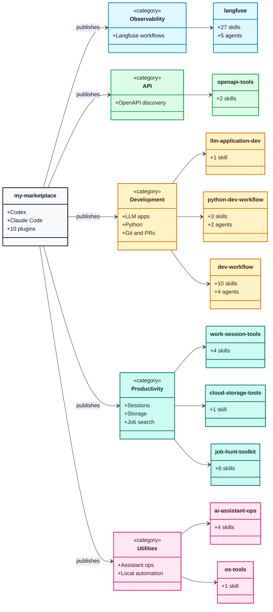

# My Marketplace

A personal marketplace of agent plugins for Codex and Claude Code.

This marketplace collects practical plugins for LLM observability, API
exploration, development workflows, assistant operations, cloud storage, local
automation, and job-search workflows.

## Notes for Users

Use this README when you want to install the marketplace, install a plugin, or
choose what each plugin is for. Developer and maintenance notes live in
`AGENTS.md`.

## Quick Install

### Codex

Add the marketplace:

```shell
codex plugin marketplace add Alex-Kopylov/my-marketplace
```

Install a plugin:

```shell
codex plugin add langfuse@my-marketplace
```

List available plugins:

```shell
codex plugin list
```

Update the installed marketplace:

```shell
codex plugin marketplace upgrade my-marketplace
```

### Claude Code

Add the marketplace from inside Claude Code:

```shell
/plugin marketplace add Alex-Kopylov/my-marketplace
```

Install a plugin:

```shell
/plugin install langfuse@my-marketplace
```

Update the installed marketplace:

```shell
/plugin marketplace update my-marketplace
```

For scripts or automation, use the non-interactive CLI:

```shell
claude plugin marketplace add Alex-Kopylov/my-marketplace
claude plugin install langfuse@my-marketplace
claude plugin marketplace update my-marketplace
```

## How to Use

1. Add this marketplace to Codex or Claude Code.
2. Pick a plugin from the catalog below.
3. Install the plugin with `plugin@my-marketplace`, for example
   `langfuse@my-marketplace`.
4. Ask the assistant naturally for the workflow you want. The installed plugin
   contributes skills, agents, or both.

## Plugin Catalog



| Plugin | Category | Best for | Inside |
|---|---|---|---|
| `langfuse` | Observability | Langfuse traces, datasets, experiments, evaluators, metrics, and dashboards. | 27 skills, 5 agents |
| `openapi-tools` | API | Listing and inspecting OpenAPI endpoints on running services. | 2 skills |
| `llm-application-dev` | Development | Schema-guided LLM application design. | 1 skill |
| `python-dev-workflow` | Development | Python tests, Redis isolation, Celery patterns, and test review. | 3 skills, 2 agents |
| `dev-workflow` | Development | Git, PRs, tickets, releases, review feedback, and specs. | 10 skills, 4 agents |
| `work-session-tools` | Productivity | Daily notes, task tracking, interviews, and multi-agent team design. | 4 skills |
| `ai-assistant-ops` | Utilities | Assistant setup audits, AGENTS.md maintenance, memory capture, and Markdown cleanup. | 4 skills |
| `os-tools` | Utilities | Local macOS automation helpers. | 1 skill |
| `cloud-storage-tools` | Productivity | MEGA-style cloud storage workflows. | 1 skill |
| `job-hunt-toolkit` | Productivity | Job applications, resume tailoring, PDF export, metadata scrubbing, and pre-send checks. | 6 skills |

## Plugins

### `langfuse`

<details>
<summary>General-purpose Langfuse integration for observability, datasets, experiments, evaluators, and dashboards.</summary>

**Use when:** you need to inspect Langfuse data, create or update evaluation
assets, compare experiment runs, or manage dashboard widgets.

**Skills:** `analyze-experiment-results`, `compare-experiments`,
`configure-remote-experiment`, `create-dataset`, `create-evaluator`,
`create-widget`, `delete-evaluator`, `delete-widget`,
`design-dataset-schema`, `discover-datasets`, `discover-filter-options`,
`discover-models`, `discover-scores`, `discover-traces`,
`inspect-evaluator`, `layout-widgets`, `list-dataset-runs`,
`list-evaluators`, `list-widgets`, `manage-dashboard`,
`manage-dataset-items`, `query-metrics`, `suggest-widgets`,
`toggle-evaluator-status`, `trigger-experiment`, `update-evaluator`,
`update-widget`

**Agents:** `langfuse-data-explorer`, `langfuse-dataset-expert`,
`langfuse-eval-manager`, `langfuse-experiment-manager`,
`langfuse-widget-manager`

</details>

### `openapi-tools`

<details>
<summary>Skills for listing and inspecting OpenAPI endpoints on running services.</summary>

**Use when:** you have a running API service and want the assistant to discover
available endpoints or inspect operation details.

**Skills:** `openapi-list`, `openapi-inspect`

</details>

### `llm-application-dev`

LLM application design and schema-guided reasoning patterns.

**Skill:** `schema-guided-reasoning`

### `python-dev-workflow`

<details>
<summary>Python workflow helpers for tests, Redis, Celery, and test review.</summary>

**Use when:** you are writing or reviewing Python tests, working with Redis test
isolation, or configuring Celery for production behavior.

**Skills:** `celery-expert`, `pytest-redis`, `writing-unit-tests`

**Agents:** `test-runner`, `test-unit-reviewer`

</details>

### `dev-workflow`

<details>
<summary>Git, pull request, ticket, release, review-comment, and specification workflows.</summary>

**Use when:** you need structured development workflow support: commits, PRs,
review comments, ticket branches, status updates, version bumps, or spec checks.

**Skills:** `commit`, `create-pr`, `pr-address-comments`, `pr-checkout`,
`pr-comment`, `spec-contradiction-hunter`, `spec-interview`,
`ticket-branch`, `ticket-comment-status`, `version-bumper`

**Agents:** `ambiguity-contradiction-hunter`, `release-manager`,
`structural-contradiction-hunter`, `surface-contradiction-hunter`

</details>

### `work-session-tools`

<details>
<summary>Productivity and orchestration inside an assistant session.</summary>

**Use when:** you want daily notes, task tracking, structured interviews, or a
designed multi-agent team for a larger work session.

**Skills:** `create-team`, `daily`, `interview`, `task-management`

</details>

### `ai-assistant-ops`

<details>
<summary>Assistant setup, instruction hygiene, memory capture, and Markdown maintenance.</summary>

**Use when:** you want to audit assistant instructions, improve AGENTS.md files,
capture useful session insights, or reduce Markdown bloat.

**Skills:** `agents-md-improver`, `ai-insights-hunter`, `ai-setup-audit`,
`md-bloat-hunter`

</details>

### `os-tools`

Operating-system utilities for local machine automation.

**Skill:** `loop_macos`

### `cloud-storage-tools`

Cloud storage workflows for MEGA-style user-file storage tools.

**Skill:** `mega-cmd`

### `job-hunt-toolkit`

<details>
<summary>Version-controlled job application workspace with resume tailoring and PDF safety checks.</summary>

**Use when:** you want a structured job application workspace, tailored resumes,
HTML-to-PDF export, PDF metadata scrubbing, or a final pre-send checklist.

**Skills:** `export-pdf`, `init-workspace`, `new-application`,
`prepare-to-send`, `resume-tailoring`, `scrub-pdf-metadata`

</details>

## Runtime Support

| Runtime | Marketplace metadata | Plugin metadata |
|---|---|---|
| Codex | `.agents/plugins/marketplace.json` | `plugins/*/.codex-plugin/plugin.json` |
| Claude Code | `.claude-plugin/marketplace.json` | `plugins/*/.claude-plugin/plugin.json` |

## Official References

- [Codex plugin marketplace CLI](https://developers.openai.com/codex/cli/reference#codex-plugin-marketplace)
- [Claude Code plugin marketplaces](https://code.claude.com/docs/en/plugin-marketplaces)
