# My Marketplace

A personal marketplace of agent plugins for Codex and Claude Code.

This marketplace collects practical plugins for LLM observability, API
exploration, development workflows, assistant operations, cloud storage, local
automation, and job-search workflows.

## Notes for Users

Use this README when you want to install the marketplace, install a plugin, or
choose what each plugin is for. Developer and maintenance notes live in
`AGENTS.md`.

## Quick Install

### Codex

Add the marketplace:

```shell
codex plugin marketplace add Alex-Kopylov/my-marketplace
```

Install a plugin:

```shell
codex plugin add langfuse@my-marketplace
```

List available plugins:

```shell
codex plugin list
```

Update the installed marketplace:

```shell
codex plugin marketplace upgrade my-marketplace
```

### Claude Code

Add the marketplace from inside Claude Code:

```shell
/plugin marketplace add Alex-Kopylov/my-marketplace
```

Install a plugin:

```shell
/plugin install langfuse@my-marketplace
```

Update the installed marketplace:

```shell
/plugin marketplace update my-marketplace
```

For scripts or automation, use the non-interactive CLI:

```shell
claude plugin marketplace add Alex-Kopylov/my-marketplace
claude plugin install langfuse@my-marketplace
claude plugin marketplace update my-marketplace
```

## How to Use

1. Add this marketplace to Codex or Claude Code.
2. Pick a plugin from the catalog below.
3. Install the plugin with `plugin@my-marketplace`, for example
   `langfuse@my-marketplace`.
4. Ask the assistant naturally for the workflow you want. The installed plugin
   contributes skills, agents, or both.

## Plugin Catalog

```mermaid
classDiagram
direction LR

class Langfuse["langfuse"]:::langfuse {
  +analyze-experiment-results
  +compare-experiments
  +configure-remote-experiment
  +create-dataset
  +create-evaluator
  +create-widget
  +delete-evaluator
  +delete-widget
  +design-dataset-schema
  +discover-datasets
  +discover-filter-options
  +discover-models
  +discover-scores
  +discover-traces
  +inspect-evaluator
  +layout-widgets
  +list-dataset-runs
  +list-evaluators
  +list-widgets
  +manage-dashboard
  +manage-dataset-items
  +query-metrics
  +suggest-widgets
  +toggle-evaluator-status
  +trigger-experiment
  +update-evaluator
  +update-widget
}
class LangfuseAgents["langfuse agents"]:::langfuseAgents {
  +langfuse-data-explorer
  +langfuse-dataset-expert
  +langfuse-eval-manager
  +langfuse-experiment-manager
  +langfuse-widget-manager
}

class OpenAPITools["openapi-tools"]:::openapi {
  +openapi-list
  +openapi-inspect
}

class LLMApplicationDev["llm-application-dev"]:::llm {
  +schema-guided-reasoning
}

class PythonDevWorkflow["python-dev-workflow"]:::python {
  +celery-expert
  +pytest-redis
  +writing-unit-tests
}
class PythonDevWorkflowAgents["python-dev-workflow agents"]:::pythonAgents {
  +test-runner
  +test-unit-reviewer
}

class DevWorkflow["dev-workflow"]:::dev {
  +commit
  +create-pr
  +pr-address-comments
  +pr-checkout
  +pr-comment
  +spec-contradiction-hunter
  +spec-interview
  +ticket-branch
  +ticket-comment-status
  +version-bumper
}
class DevWorkflowAgents["dev-workflow agents"]:::devAgents {
  +ambiguity-contradiction-hunter
  +release-manager
  +structural-contradiction-hunter
  +surface-contradiction-hunter
}

class WorkSessionTools["work-session-tools"]:::session {
  +create-team
  +daily
  +interview
  +task-management
}

class AIAssistantOps["ai-assistant-ops"]:::ops {
  +agents-md-improver
  +ai-insights-hunter
  +ai-setup-audit
  +md-bloat-hunter
}
class AIInsightsHunterAgents["ai-insights-hunter agents"]:::opsAgents {
  +decisions-hunter
  +patterns-hunter
  +preferences-hunter
  +project-context-hunter
}
class MDBloatHunterAgents["md-bloat-hunter agents"]:::opsAgents {
  +directory-redundancy-detector
  +file-orchestrator
  +filler-eliminator
  +redundancy-detector
  +verbosity-pruner
  +vocab-compressor
}

class OSTools["os-tools"]:::os {
  +loop_macos
}

class CloudStorageTools["cloud-storage-tools"]:::storage {
  +mega-cmd
}

class JobHuntToolkit["job-hunt-toolkit"]:::job {
  +export-pdf
  +init-workspace
  +new-application
  +prepare-to-send
  +resume-tailoring
  +scrub-pdf-metadata
}

Langfuse --> LangfuseAgents : agents
PythonDevWorkflow --> PythonDevWorkflowAgents : agents
DevWorkflow --> DevWorkflowAgents : agents
AIAssistantOps --> AIInsightsHunterAgents : ai-insights-hunter agents
AIAssistantOps --> MDBloatHunterAgents : md-bloat-hunter agents

classDef langfuse fill:#dff7ff,stroke:#0284c7,stroke-width:2px,color:#0f172a;
classDef langfuseAgents fill:#eefbff,stroke:#0369a1,stroke-width:2px,color:#0f172a;
classDef openapi fill:#dcfce7,stroke:#16a34a,stroke-width:2px,color:#052e16;
classDef llm fill:#fef3c7,stroke:#d97706,stroke-width:2px,color:#451a03;
classDef python fill:#ede9fe,stroke:#7c3aed,stroke-width:2px,color:#2e1065;
classDef pythonAgents fill:#f5f3ff,stroke:#6d28d9,stroke-width:2px,color:#2e1065;
classDef dev fill:#fee2e2,stroke:#dc2626,stroke-width:2px,color:#450a0a;
classDef devAgents fill:#fff1f2,stroke:#be123c,stroke-width:2px,color:#4c0519;
classDef session fill:#ccfbf1,stroke:#0f766e,stroke-width:2px,color:#042f2e;
classDef ops fill:#fce7f3,stroke:#db2777,stroke-width:2px,color:#500724;
classDef opsAgents fill:#fdf2f8,stroke:#be185d,stroke-width:2px,color:#500724;
classDef os fill:#e0e7ff,stroke:#4f46e5,stroke-width:2px,color:#1e1b4b;
classDef storage fill:#ecfccb,stroke:#65a30d,stroke-width:2px,color:#1a2e05;
classDef job fill:#ffedd5,stroke:#ea580c,stroke-width:2px,color:#431407;
```



| Plugin | Best for | Inside |
|---|---|---|
| `langfuse` | Langfuse traces, datasets, experiments, evaluators, metrics, and dashboards. | 27 skills, 5 agents |
| `openapi-tools` | Listing and inspecting OpenAPI endpoints on running services. | 2 skills |
| `llm-application-dev` | Schema-guided LLM application design. | 1 skill |
| `python-dev-workflow` | Python tests, Redis isolation, Celery patterns, and test review. | 3 skills, 2 agents |
| `dev-workflow` | Git, PRs, tickets, releases, review feedback, and specs. | 10 skills, 4 agents |
| `work-session-tools` | Daily notes, task tracking, interviews, and multi-agent team design. | 4 skills |
| `ai-assistant-ops` | Assistant setup audits, AGENTS.md maintenance, memory capture, and Markdown cleanup. | 4 skills, 10 skill agents |
| `os-tools` | Local macOS automation helpers. | 1 skill |
| `cloud-storage-tools` | MEGA-style cloud storage workflows. | 1 skill |
| `job-hunt-toolkit` | Job applications, resume tailoring, PDF export, metadata scrubbing, and pre-send checks. | 6 skills |

## Plugins

### `langfuse`

<details>
<summary>General-purpose Langfuse integration for observability, datasets, experiments, evaluators, and dashboards.</summary>

**Use when:** you need to inspect Langfuse data, create or update evaluation
assets, compare experiment runs, or manage dashboard widgets.

**Skills**

| Skill | Description |
|---|---|
| `analyze-experiment-results` | Analyze scores and per-item results for a dataset run. |
| `compare-experiments` | Compare experiment runs and detect regressions. |
| `configure-remote-experiment` | Configure remote experiment webhooks and payloads. |
| `create-dataset` | Create Langfuse datasets with optional schemas. |
| `create-evaluator` | Create LLM-as-a-Judge evaluators. |
| `create-widget` | Create dashboard widgets. |
| `delete-evaluator` | Remove evaluators after safety checks. |
| `delete-widget` | Remove dashboard widgets safely. |
| `design-dataset-schema` | Design dataset item input and output schemas. |
| `discover-datasets` | List datasets, items, runs, and metadata. |
| `discover-filter-options` | Discover trace filter values for evaluators. |
| `discover-models` | List tracked models and pricing. |
| `discover-scores` | Enumerate score names, types, and sources. |
| `discover-traces` | Explore trace names, tags, environments, and users. |
| `inspect-evaluator` | Show evaluator prompts, versions, and job configs. |
| `layout-widgets` | Calculate dashboard widget grid placement. |
| `list-dataset-runs` | Browse experiment runs for datasets. |
| `list-evaluators` | Summarize evaluator configurations. |
| `list-widgets` | Inventory dashboard widgets. |
| `manage-dashboard` | Create, update, delete, and arrange dashboards. |
| `manage-dataset-items` | Add, update, archive, delete, or import dataset items. |
| `query-metrics` | Query Langfuse metrics and aggregates. |
| `suggest-widgets` | Recommend useful dashboard visualizations. |
| `toggle-evaluator-status` | Enable, disable, pause, or resume evaluators. |
| `trigger-experiment` | Start dataset runs or remote experiments. |
| `update-evaluator` | Update evaluator prompts, filters, or model config. |
| `update-widget` | Modify existing widget configuration. |

**Agents**

| Agent | Description |
|---|---|
| `langfuse-data-explorer` | Read-only discovery for scores, traces, models, and metrics. |
| `langfuse-dataset-expert` | Dataset creation, item management, and schema design. |
| `langfuse-eval-manager` | Evaluator CRUD, filters, and status management. |
| `langfuse-experiment-manager` | Experiment runs, analysis, comparison, and webhooks. |
| `langfuse-widget-manager` | Dashboard and widget creation, updates, and suggestions. |

</details>

### `openapi-tools`

<details>
<summary>Skills for listing and inspecting OpenAPI endpoints on running services.</summary>

**Use when:** you have a running API service and want the assistant to discover
available endpoints or inspect operation details.

| Skill | Description |
|---|---|
| `openapi-list` | List available OpenAPI routes. |
| `openapi-inspect` | Inspect endpoint inputs, outputs, and schema details. |

</details>

### `llm-application-dev`

LLM application design and schema-guided reasoning patterns.

| Skill | Description |
|---|---|
| `schema-guided-reasoning` | Design structured Pydantic schemas that guide LLM reasoning. |

### `python-dev-workflow`

<details>
<summary>Python workflow helpers for tests, Redis, Celery, and test review.</summary>

**Use when:** you are writing or reviewing Python tests, working with Redis test
isolation, or configuring Celery for production behavior.

**Skills**

| Skill | Description |
|---|---|
| `celery-expert` | Configure Celery, workers, retries, schedules, and tests. |
| `pytest-redis` | Test Redis code with fakeredis, fixtures, or containers. |
| `writing-unit-tests` | Write pytest unit tests with reliable mocks and fixtures. |

**Agents**

| Agent | Description |
|---|---|
| `test-runner` | Run focused pytest or `uv run pytest` commands. |
| `test-unit-reviewer` | Review unit tests for quality, coverage, and patterns. |

</details>

### `dev-workflow`

<details>
<summary>Git, pull request, ticket, release, review-comment, and specification workflows.</summary>

**Use when:** you need structured development workflow support: commits, PRs,
review comments, ticket branches, status updates, version bumps, or spec checks.

**Skills**

| Skill | Description |
|---|---|
| `commit` | Create single-line Conventional Commits. |
| `create-pr` | Open pull requests from the current branch. |
| `pr-address-comments` | Fetch, fix, reply to, and resolve PR feedback. |
| `pr-checkout` | Switch to a PR branch for review or changes. |
| `pr-comment` | Post general or inline PR comments. |
| `spec-contradiction-hunter` | Find contradictions and inconsistencies in specs. |
| `spec-interview` | Interview the user and produce an implementation spec. |
| `ticket-branch` | Create a git branch from a ticket ID or URL. |
| `ticket-comment-status` | Post status updates to tickets or work items. |
| `version-bumper` | Bump versions in plugin and package metadata. |

**Agents**

| Agent | Description |
|---|---|
| `ambiguity-contradiction-hunter` | Finds hidden contradictions from vague language. |
| `release-manager` | Coordinates version bump and commit workflows. |
| `structural-contradiction-hunter` | Finds deeper logical and scope conflicts. |
| `surface-contradiction-hunter` | Finds direct, explicit contradictions. |

</details>

### `work-session-tools`

<details>
<summary>Productivity and orchestration inside an assistant session.</summary>

**Use when:** you want daily notes, task tracking, structured interviews, or a
designed multi-agent team for a larger work session.

| Skill | Description |
|---|---|
| `create-team` | Design a multi-agent team and handoff plan. |
| `daily` | Generate a daily note from project activity. |
| `interview` | Walk through a list of items one by one. |
| `task-management` | Track, split, and orchestrate session tasks. |

</details>

### `ai-assistant-ops`

<details>
<summary>Assistant setup, instruction hygiene, memory capture, and Markdown maintenance.</summary>

**Use when:** you want to audit assistant instructions, improve AGENTS.md files,
capture useful session insights, or reduce Markdown bloat.

**Skills**

| Skill | Description |
|---|---|
| `agents-md-improver` | Audit and improve repository AGENTS.md files. |
| `ai-insights-hunter` | Extract reusable decisions, patterns, and preferences from a session. |
| `ai-setup-audit` | Audit assistant configuration files for conflicts and bloat. |
| `md-bloat-hunter` | Trim redundancy, verbosity, and filler in Markdown. |

**Skill Agents**

| Skill | Agent | Description |
|---|---|---|
| `ai-insights-hunter` | `decisions-hunter` | Extracts durable decisions from a conversation. |
| `ai-insights-hunter` | `patterns-hunter` | Finds recurring workflow and implementation patterns. |
| `ai-insights-hunter` | `preferences-hunter` | Identifies user preferences worth preserving. |
| `ai-insights-hunter` | `project-context-hunter` | Captures project-specific context and constraints. |
| `md-bloat-hunter` | `directory-redundancy-detector` | Finds repeated guidance across Markdown directories. |
| `md-bloat-hunter` | `file-orchestrator` | Coordinates per-file Markdown cleanup. |
| `md-bloat-hunter` | `filler-eliminator` | Removes low-value filler language. |
| `md-bloat-hunter` | `redundancy-detector` | Spots repeated content inside files. |
| `md-bloat-hunter` | `verbosity-pruner` | Compresses overlong explanations. |
| `md-bloat-hunter` | `vocab-compressor` | Replaces inflated wording with direct wording. |

</details>

### `os-tools`

Operating-system utilities for local machine automation.

| Skill | Description |
|---|---|
| `loop_macos` | Schedule persistent macOS launchd commands or prompts. |

### `cloud-storage-tools`

Cloud storage workflows for MEGA-style user-file storage tools.

| Skill | Description |
|---|---|
| `mega-cmd` | Manage encrypted MEGA storage, links, sync, search, and backups. |

### `job-hunt-toolkit`

<details>
<summary>Version-controlled job application workspace with resume tailoring and PDF safety checks.</summary>

**Use when:** you want a structured job application workspace, tailored resumes,
HTML-to-PDF export, PDF metadata scrubbing, or a final pre-send checklist.

| Skill | Description |
|---|---|
| `export-pdf` | Render HTML CVs to PDF with headless Chromium. |
| `init-workspace` | Scaffold the job application workspace. |
| `new-application` | Create a company application folder and starter files. |
| `prepare-to-send` | Run final filename, metadata, and content checks. |
| `resume-tailoring` | Tailor a CV to a job description without fabrication. |
| `scrub-pdf-metadata` | Strip sensitive PDF metadata before sending. |

</details>

## Runtime Support

| Runtime | Marketplace metadata | Plugin metadata |
|---|---|---|
| Codex | `.agents/plugins/marketplace.json` | `plugins/*/.codex-plugin/plugin.json` |
| Claude Code | `.claude-plugin/marketplace.json` | `plugins/*/.claude-plugin/plugin.json` |

## Official References

- [Codex plugin marketplace CLI](https://developers.openai.com/codex/cli/reference#codex-plugin-marketplace)
- [Claude Code plugin marketplaces](https://code.claude.com/docs/en/plugin-marketplaces)
