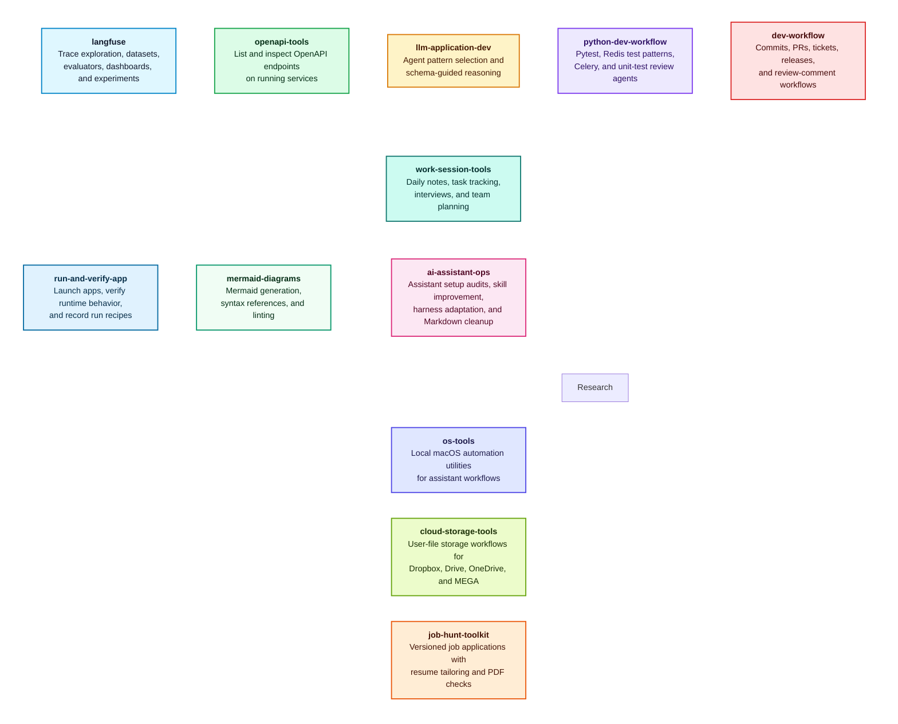

# 🗡️ Zweihander

Simple, robust, and versatile marketplace for agent plugins,
forged for the chaos of the AI world.

It collects practical tools for Codex and Claude Code across LLM observability,
API exploration, development workflows, assistant operations, research notes,
cloud storage, local automation, runtime app verification, and job-search
workflows.

## Plugin Catalog



## Notes for Users

Use this README when you want to install the marketplace, install a plugin, or
choose what each plugin is for. Developer and maintenance notes live in
`AGENTS.md`.

## Quick Install

### Codex

Add the marketplace:

```shell
codex plugin marketplace add Alex-Kopylov/zweihander
```

Install a plugin:

```shell
codex plugin add langfuse@zweihander
```

List available plugins:

```shell
codex plugin list
```

Update the installed marketplace:

```shell
codex plugin marketplace upgrade zweihander
```

### Claude Code

Add the marketplace from inside Claude Code:

```shell
/plugin marketplace add Alex-Kopylov/zweihander
```

Install a plugin:

```shell
/plugin install langfuse@zweihander
```

Update the installed marketplace:

```shell
/plugin marketplace update zweihander
```

For scripts or automation, use the non-interactive CLI:

```shell
claude plugin marketplace add Alex-Kopylov/zweihander
claude plugin install langfuse@zweihander
claude plugin marketplace update zweihander
```

## How to Use

1. Add this marketplace to Codex or Claude Code.
2. Pick a plugin from the catalog below.
3. Install the plugin with `plugin@zweihander`, for example
   `langfuse@zweihander`.
4. Ask the assistant naturally for the workflow you want. The installed plugin
   contributes skills, agents, or both.

## Plugins

### `langfuse`

**Use when:** you need to inspect Langfuse data, create or update evaluation
assets, compare experiment runs, or manage dashboard widgets.

**Skills**

| Skill | Description |
|---|---|
| `analyze-experiment-results` | Analyze scores and per-item results for a dataset run. |
| `compare-experiments` | Compare experiment runs and detect regressions. |
| `configure-remote-experiment` | Configure remote experiment webhooks and payloads. |
| `create-dataset` | Create Langfuse datasets with optional schemas. |
| `create-evaluator` | Create LLM-as-a-Judge evaluators. |
| `create-widget` | Create dashboard widgets. |
| `delete-evaluator` | Remove evaluators after safety checks. |
| `delete-widget` | Remove dashboard widgets safely. |
| `design-dataset-schema` | Design dataset item input and output schemas. |
| `discover-datasets` | List datasets, items, runs, and metadata. |
| `discover-filter-options` | Discover trace filter values for evaluators. |
| `discover-models` | List tracked models and pricing. |
| `discover-scores` | Enumerate score names, types, and sources. |
| `discover-traces` | Explore trace names, tags, environments, and users. |
| `inspect-evaluator` | Show evaluator prompts, versions, and job configs. |
| `layout-widgets` | Calculate dashboard widget grid placement. |
| `list-dataset-runs` | Browse experiment runs for datasets. |
| `list-evaluators` | Summarize evaluator configurations. |
| `list-widgets` | Inventory dashboard widgets. |
| `manage-dashboard` | Create, update, delete, and arrange dashboards. |
| `manage-dataset-items` | Add, update, archive, delete, or import dataset items. |
| `query-metrics` | Query Langfuse metrics and aggregates. |
| `suggest-widgets` | Recommend useful dashboard visualizations. |
| `toggle-evaluator-status` | Enable, disable, pause, or resume evaluators. |
| `trigger-experiment` | Start dataset runs or remote experiments. |
| `update-evaluator` | Update evaluator prompts, filters, or model config. |
| `update-widget` | Modify existing widget configuration. |

**Agents**

| Agent | Description |
|---|---|
| `langfuse-data-explorer` | Read-only discovery for scores, traces, models, and metrics. |
| `langfuse-dataset-expert` | Dataset creation, item management, and schema design. |
| `langfuse-eval-manager` | Evaluator CRUD, filters, and status management. |
| `langfuse-experiment-manager` | Experiment runs, analysis, comparison, and webhooks. |
| `langfuse-widget-manager` | Dashboard and widget creation, updates, and suggestions. |

### `openapi-tools`

**Use when:** you have a running API service and want the assistant to discover
available endpoints or inspect operation details.

**Skills**

| Skill | Description |
|---|---|
| `openapi-list` | List available OpenAPI routes. |
| `openapi-inspect` | Inspect endpoint inputs, outputs, and schema details. |

### `llm-application-dev`

<details>
<summary>LLM application design, agent pattern selection, and schema-guided reasoning patterns.</summary>

**Use when:** you need to choose LLM workflow patterns, compare agent
architecture trade-offs, or design structured schemas that guide model
reasoning.

**Skills**

| Skill | Description |
|---|---|
| `select-agent-patterns` | Choose LLM workflow and agent design patterns by decomposing a problem into stages and comparing candidates. Based on [A Two-Dimensional Framework for AI Agent Design Patterns](https://arxiv.org/pdf/2605.13850). |
| `schema-guided-reasoning` | Design structured Pydantic schemas that guide LLM reasoning. |

</details>

### `python-dev-workflow`

**Use when:** you are writing or reviewing Python tests, working with Redis test
isolation, or configuring Celery for production behavior.

**Skills**

| Skill | Description |
|---|---|
| `celery-expert` | Configure Celery, workers, retries, schedules, and tests. |
| `pytest-redis` | Test Redis code with fakeredis, fixtures, or containers. |
| `writing-unit-tests` | Write pytest unit tests with reliable mocks and fixtures. |

**Agents**

| Agent | Description |
|---|---|
| `test-runner` | Run focused pytest or `uv run pytest` commands. |
| `test-unit-reviewer` | Review unit tests for quality, coverage, and patterns. |

### `dev-workflow`

**Use when:** you need structured development workflow support: commits, PRs,
review comments, ticket branches, status updates, version bumps, or spec checks.

**Skills**

| Skill | Description |
|---|---|
| `commit` | Create single-line Conventional Commits. |
| `create-pr` | Open pull requests from the current branch. |
| `pr-address-comments` | Fetch, fix, reply to, and resolve PR feedback. |
| `pr-checkout` | Switch to a PR branch for review or changes. |
| `pr-comment` | Post general or inline PR comments. |
| `spec-contradiction-hunter` | Find contradictions and inconsistencies in specs. |
| `spec-interview` | Interview the user and produce an implementation spec. |
| `ticket-branch` | Create a git branch from a ticket ID or URL. |
| `ticket-comment-status` | Post status updates to tickets or work items. |
| `version-bumper` | Bump versions in plugin and package metadata. |

**Agents**

| Agent | Description |
|---|---|
| `ambiguity-contradiction-hunter` | Finds hidden contradictions from vague language. |
| `release-manager` | Coordinates version bump and commit workflows. |
| `structural-contradiction-hunter` | Finds deeper logical and scope conflicts. |
| `surface-contradiction-hunter` | Finds direct, explicit contradictions. |

### `run-and-verify-app`

<details>
<summary>Runtime app launch, verification, and run-skill generation inspired by Claude Code.</summary>

**Use when:** you want to launch an app, verify a change against the
running app instead of just tests, or record a reusable build and launch
recipe for a project.

Inspired by Claude Code's bundled run and verify app workflow, this plugin
brings three coordinated skills to Codex. It is Codex-only; Claude Code users
can use Claude Code's built-in run and verify skills.

This is an opinionated adaptation, not a 1-to-1 port. It reflects this
marketplace's preferences for runtime evidence and reusable project run skills.

| Skill | Purpose |
|---|---|
| `run` | Launch and drive your app to see a change working. |
| `verify` | Build and run your app to confirm a code change does what it should, without falling back to tests or type checks. |
| `run-skill-generator` | Teach `run` and `verify` how to build and launch your project by recording a verified project-specific recipe. |

</details>

### `mermaid-diagrams`

Generate and validate Mermaid diagrams with synced syntax references.

**Use when:** you want to create Mermaid diagrams from requirements or validate
Mermaid code blocks with the Mermaid CLI.

**Skills**

| Skill | Description |
|---|---|
| `mermaid` | Generate Mermaid diagrams from user requirements with local syntax references. |
| `mermaid-lint` | Validate Mermaid code blocks with `mmdc` and report lint status and errors. |

### `work-session-tools`

**Use when:** you want daily notes, task tracking, structured interviews, or a
designed multi-agent team for a larger work session.

**Skills**

| Skill | Description |
|---|---|
| `create-team` | Design a multi-agent team and handoff plan. |
| `daily` | Generate a daily note from project activity. |
| `interview` | Walk through a list of items one by one. |
| `task-management` | Track, split, and orchestrate session tasks. |

### `research`

<details>
<summary>Research wiki and Obsidian vault workflows for agent-maintained notes.</summary>

**Use when:** you want to create or query an interlinked research wiki, ingest
sources into a knowledge base, lint wiki health, or work with Obsidian notes.

**Origin:** ports MIT-licensed skills from
[NousResearch/hermes-agent](https://github.com/NousResearch/hermes-agent):
[`llm-wiki`](https://raw.githubusercontent.com/NousResearch/hermes-agent/refs/heads/main/skills/research/llm-wiki/SKILL.md)
and
[`obsidian`](https://raw.githubusercontent.com/NousResearch/hermes-agent/refs/heads/main/skills/note-taking/obsidian/SKILL.md).

**Skills**

| Skill | Description |
|---|---|
| `llm-wiki` | Build, query, ingest into, and lint an interlinked Markdown research wiki inspired by Andrej Karpathy's LLM Wiki pattern. |
| `obsidian` | Read, search, create, append to, and edit notes in a filesystem-first Obsidian vault. |

</details>

### `ai-assistant-ops`

**Use when:** you want to audit assistant instructions, improve AGENTS.md files,
improve existing skills, adapt skills for assistant harnesses, capture useful
session insights, or reduce Markdown bloat.

**Skills**

| Skill | Description |
|---|---|
| `adapt-skill-for-ai-harness` | Adapt explicitly named skills using a JSON assistant action matrix and target-specific harness references. |
| `agents-md-improver` | Audit and improve repository AGENTS.md files. |
| `ai-insights-hunter` | Extract reusable decisions, patterns, and preferences from a session. |
| `ai-setup-audit` | Audit assistant configuration files for conflicts and bloat. |
| `improve-skill` | Improve existing skills through eval feedback, baseline comparison, iteration, and trigger checks. |
| `md-bloat-hunter` | Trim redundancy, verbosity, and filler in Markdown. |

**Skill Agents**

| Skill | Agent | Description |
|---|---|---|
| `ai-insights-hunter` | `decisions-hunter` | Extracts durable decisions from a conversation. |
| `ai-insights-hunter` | `patterns-hunter` | Finds recurring workflow and implementation patterns. |
| `ai-insights-hunter` | `preferences-hunter` | Identifies user preferences worth preserving. |
| `ai-insights-hunter` | `project-context-hunter` | Captures project-specific context and constraints. |
| `md-bloat-hunter` | `directory-redundancy-detector` | Finds repeated guidance across Markdown directories. |
| `md-bloat-hunter` | `file-orchestrator` | Coordinates per-file Markdown cleanup. |
| `md-bloat-hunter` | `filler-eliminator` | Removes low-value filler language. |
| `md-bloat-hunter` | `redundancy-detector` | Spots repeated content inside files. |
| `md-bloat-hunter` | `size-budget-reporter` | Reports Markdown size and token budget status. |
| `md-bloat-hunter` | `verbosity-pruner` | Compresses overlong explanations. |
| `md-bloat-hunter` | `vocab-compressor` | Replaces inflated wording with direct wording. |

### `os-tools`

Operating-system utilities for local machine automation.

**Skills**

| Skill | Description |
|---|---|
| `loop_macos` | Schedule persistent macOS launchd commands or prompts. |

### `cloud-storage-tools`

Cloud storage workflows for MEGA-style user-file storage tools.

**Skills**

| Skill | Description |
|---|---|
| `mega-cmd` | Manage encrypted MEGA storage, links, sync, search, and backups. |

### `job-hunt-toolkit`

**Use when:** you want a structured job application workspace, tailored resumes,
HTML-to-PDF export, PDF metadata scrubbing, or a final pre-send checklist.

**Skills**

| Skill | Description |
|---|---|
| `export-pdf` | Render HTML CVs to PDF with headless Chromium. |
| `init-workspace` | Scaffold the job application workspace. |
| `new-application` | Create a company application folder and starter files. |
| `prepare-to-send` | Run final filename, metadata, and content checks. |
| `resume-tailoring` | Tailor a CV to a job description without fabrication. |
| `scrub-pdf-metadata` | Strip sensitive PDF metadata before sending. |

## Recommended Third-Party Plugins

These are useful companion plugin and skill collections to consider alongside
this marketplace:

- [browser-harness](https://github.com/browser-use/browser-harness) - direct browser control through CDP.
- [plannotator](https://github.com/backnotprop/plannotator) - browser-based plan review, annotation, and visual explanation workflows.
- [worktrunk](https://github.com/max-sixty/worktrunk) - worktree and branch workflow support.
- [ralphex](https://github.com/umputun/ralphex) - AI-assisted development planning and project workflow tools.
- [wshobson/agents](https://github.com/wshobson/agents) - Claude Code workflow skills for Python, LLM applications, debugging, testing, and PR work.

## Runtime Support

| Runtime | Marketplace metadata | Plugin metadata |
|---|---|---|
| Codex | `.agents/plugins/marketplace.json` | `plugins/*/.codex-plugin/plugin.json` |
| Claude Code | `.claude-plugin/marketplace.json` | `plugins/*/.claude-plugin/plugin.json` |

## Official References

- [Codex plugin marketplace CLI](https://developers.openai.com/codex/cli/reference#codex-plugin-marketplace)
- [Claude Code plugin marketplaces](https://code.claude.com/docs/en/plugin-marketplaces)
