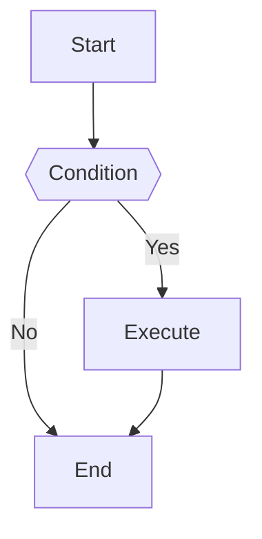

# Mermaid Diagram Generator

Generate high-quality Mermaid diagram code based on user requirements.

## Workflow

1. **Understand Requirements**: Analyze user description to determine the most suitable diagram type.
2. **Read Documentation**: Read the corresponding syntax reference for the diagram type.
3. **Generate Code**: Generate Mermaid code following the specification.
4. **Apply Styling**: Apply appropriate themes and style configurations.
5. **Optionally Lint**: If `mmdc` is installed, optionally render generated diagrams to validate syntax. If `mmdc` is unavailable and linting was not explicitly requested, skip linting by default.

## Diagram Type Reference

Select the appropriate diagram type and read the corresponding documentation. If a requested diagram type is not listed here, inspect `references/` before declaring it unsupported.

<!-- BEGIN GENERATED DIAGRAM TYPES -->
{diagram_table}
<!-- END GENERATED DIAGRAM TYPES -->

## Configuration & Themes

- [Theming](references/config-theming.md) - Custom colors and styles
- [Directives](references/config-directives.md) - Diagram-level configuration
- [Layouts](references/config-layouts.md) - Layout direction and spacing
- [Configuration](references/config-configuration.md) - Global settings
- [Math](references/config-math.md) - LaTeX math support

## Linting

If `mmdc` is installed, optionally render generated diagrams with the `mermaid-lint` skill or an equivalent `mmdc` command before declaring the diagram ready. If `mmdc` is not installed and the user did not explicitly ask for linting, skip this step and mention that linting was not run.

## Output Specification

Generated Mermaid code should:

1. Be wrapped in ```mermaid code blocks
2. Have correct syntax that renders directly
3. Have clear structure with proper line breaks and indentation
4. Use semantic node naming
5. Include styling when needed to improve visual appearance

## Example Output


