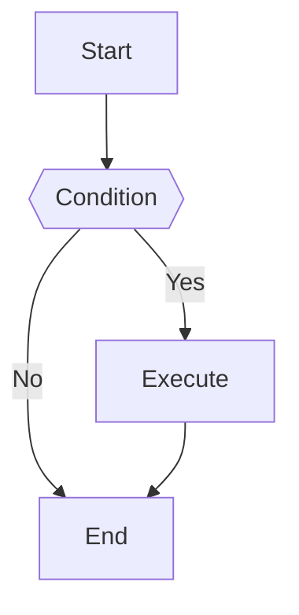

# Mermaid Diagram Generator

> Note: check current Mermaid version first and ask to upgrade if outdated.

Generate high-quality Mermaid diagram code based on user requirements.

## Workflow

1. **Understand Requirements**: Analyze user description to determine the most suitable diagram type.
2. **Read Documentation**: Read the corresponding syntax reference for the diagram type.
3. **Generate Code**: Generate Mermaid code following the specification.
4. **Apply Styling**: Apply appropriate themes and style configurations.
5. **Lint Before Presenting**: Run this plugin's `mermaid-lint` skill against every generated diagram before presenting it as ready. If linting fails, fix Mermaid syntax errors when possible and rerun linting. If `mmdc` is unavailable, do not present the diagram as validated; report the missing dependency and the install command from `mermaid-lint`.

## Diagram Type Reference

Select the appropriate diagram type and read the corresponding documentation. If a requested diagram type is not listed here, inspect `references/` before declaring it unsupported.

<!-- BEGIN GENERATED DIAGRAM TYPES -->
{diagram_table}
<!-- END GENERATED DIAGRAM TYPES -->

## Configuration & Themes

- [Theming](references/config-theming.md) - Custom colors and styles
- [Directives](references/config-directives.md) - Diagram-level configuration
- [Layouts](references/config-layouts.md) - Layout direction and spacing
- [Configuration](references/config-configuration.md) - Global settings
- [Math](references/config-math.md) - LaTeX math support

## Linting

Run this plugin's `mermaid-lint` skill before declaring generated Mermaid ready. Pass each generated diagram to the linter, inspect the result, fix Mermaid syntax errors when possible, and rerun linting until it passes. If `mmdc` is not installed, stop before final presentation and report the missing dependency instead of silently skipping validation.

## Choice Reports

When producing a multi-block choice report, use `assets/choice_report_template.html` as the base HTML. Populate its `choice-report-data` JSON with source text blocks and one or more Mermaid options per block. Multiple options may be approved for the same source block, so do not force a single approved option. Lint every Mermaid option with `mermaid-lint` before presenting the report.

## Output Specification

Generated Mermaid code should:

1. Be wrapped in ```mermaid code blocks
2. Have correct syntax that renders directly
3. Have clear structure with proper line breaks and indentation
4. Use semantic node naming
5. Include styling when needed to improve visual appearance

## Example Output


