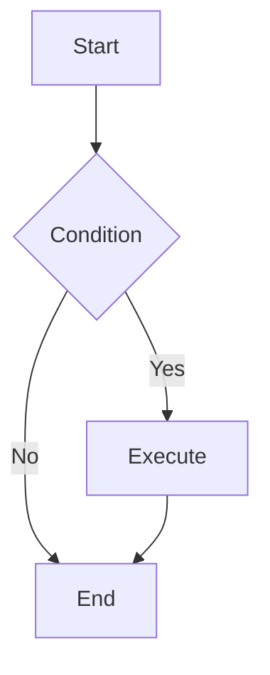

# Mermaid Diagram Generator

Generate high-quality Mermaid diagram code based on user requirements.

## Workflow

1. **Understand Requirements**: Analyze user description to determine the most suitable diagram type.
2. **Read Documentation**: Read the corresponding syntax reference for the diagram type.
3. **Generate Code**: Generate Mermaid code following the specification.
4. **Apply Styling**: Apply appropriate themes and style configurations.
5. **Optionally Lint**: If `mmdc` is installed, optionally render generated diagrams to validate syntax. If `mmdc` is unavailable and linting was not explicitly requested, skip linting by default.

## Diagram Type Reference

Select the appropriate diagram type and read the corresponding documentation. If a requested diagram type is not listed here, inspect `references/` before declaring it unsupported.

<!-- BEGIN GENERATED DIAGRAM TYPES -->
| Type | Documentation | Use Cases |
| ---- | ------------- | --------- |
| Flowchart | [flowchart.md](references/flowchart.md) | Flowcharts are composed of nodes (geometric shapes) and edges (arrows or lines). |
| Sequence Diagram | [sequenceDiagram.md](references/sequenceDiagram.md) | A Sequence diagram is an interaction diagram that shows how processes operate with one another and in what order. |
| Class Diagram | [classDiagram.md](references/classDiagram.md) | "In software engineering, a class diagram in the Unified Modeling Language (UML) is a type of static structure diagram that describes the structure of a system by showing the system's classes, their attributes, operat... |
| State Diagram | [stateDiagram.md](references/stateDiagram.md) | "A state diagram is a type of diagram used in computer science and related fields to describe the behavior of systems. |
| User Journey | [userJourney.md](references/userJourney.md) | User journeys describe at a high level of detail exactly what steps different users take to complete a specific task within a system, application or website. |
| Gantt | [gantt.md](references/gantt.md) | A Gantt chart is a type of bar chart, first developed by Karol Adamiecki in 1896, and independently by Henry Gantt in the 1910s, that illustrates a project schedule and the amount of time it would take for any one pro... |
| Pie Chart | [pie.md](references/pie.md) | A pie chart (or a circle chart) is a circular statistical graphic, which is divided into slices to illustrate numerical proportion. |
| Quadrant Chart | [quadrantChart.md](references/quadrantChart.md) | A quadrant chart is a visual representation of data that is divided into four quadrants. |
| Requirement Diagram | [requirementDiagram.md](references/requirementDiagram.md) | A Requirement diagram provides a visualization for requirements and their connections, to each other and other documented elements. |
| GitGraph (Git) Diagram | [gitgraph.md](references/gitgraph.md) | A Git Graph is a pictorial representation of git commits and git actions(commands) on various branches. |
| C4 Diagram | [c4.md](references/c4.md) | C4 Diagram: This is an experimental diagram for now. |
| Mindmaps | [mindmap.md](references/mindmap.md) | Mindmap: This is an experimental diagram for now. |
| Timeline | [timeline.md](references/timeline.md) | Timeline: This is an experimental diagram for now. |
| ZenUML | [zenuml.md](references/zenuml.md) | A Sequence diagram is an interaction diagram that shows how processes operate with one another and in what order. |
| Sankey | [sankey.md](references/sankey.md) | A sankey diagram is a visualization used to depict a flow from one set of values to another. |
| XY Chart | [xyChart.md](references/xyChart.md) | In the context of mermaid-js, the XY chart is a comprehensive charting module that encompasses various types of charts that utilize both x-axis and y-axis for data representation. |
| Block Diagram | [block.md](references/block.md) | Block diagrams are an intuitive and efficient way to represent complex systems, processes, or architectures visually. |
| Packet | [packet.md](references/packet.md) | A packet diagram is a visual representation used to illustrate the structure and contents of a network packet. |
| Kanban | [kanban.md](references/kanban.md) | Mermaid’s Kanban diagram allows you to create visual representations of tasks moving through different stages of a workflow. |
| Architecture | [architecture.md](references/architecture.md) | In the context of mermaid-js, the architecture diagram is used to show the relationship between services and resources commonly found within the Cloud or CI/CD deployments. |
| Radar | [radar.md](references/radar.md) | A radar diagram is a simple way to plot low-dimensional data in a circular format. |
| Event Modeling | [eventmodeling.md](references/eventmodeling.md) | Event Modeling (EM) is a method of describing systems using an example of how information has changed within them over time. |
| Treemap | [treemap.md](references/treemap.md) | A treemap diagram displays hierarchical data as a set of nested rectangles. |
| Venn | [venn.md](references/venn.md) | Venn diagrams show relationships between sets using overlapping circles. |
| Ishikawa | [ishikawa.md](references/ishikawa.md) | Ishikawa diagrams are used to represent causes of a specific event (or a problem). |
| Wardley | [wardley.md](references/wardley.md) | Wardley Maps are visual representations of business strategy that map value chains and component evolution. |
| Cynefin | [cynefin.md](references/cynefin.md) | The Cynefin framework is a sense-making framework created by Dave Snowden that categorizes problems into five complexity domains. |
| TreeView | [treeView.md](references/treeView.md) | A TreeView diagram is used to represent hierarchical data in the form of a directory-like structure, with file-type icons, connector lines, and optional annotations. |
| Entity Relationship Diagrams | [entityRelationshipDiagram.md](references/entityRelationshipDiagram.md) | An entity–relationship model (or ER model) describes interrelated things of interest in a specific domain of knowledge. |
| Railroad Diagrams | [railroad.md](references/railroad.md) | Railroad diagrams (also known as syntax diagrams or grammar diagrams) are a visual representation of context-free grammars using EBNF (Extended Backus-Naur Form) notation. |
<!-- END GENERATED DIAGRAM TYPES -->

## Configuration & Themes

- [Theming](references/config-theming.md) - Custom colors and styles
- [Directives](references/config-directives.md) - Diagram-level configuration
- [Layouts](references/config-layouts.md) - Layout direction and spacing
- [Configuration](references/config-configuration.md) - Global settings
- [Math](references/config-math.md) - LaTeX math support

## Linting

If `mmdc` is installed, optionally render generated diagrams with the `mermaid-lint` skill or an equivalent `mmdc` command before declaring the diagram ready. If `mmdc` is not installed and the user did not explicitly ask for linting, skip this step and mention that linting was not run.

## Output Specification

Generated Mermaid code should:

1. Be wrapped in ```mermaid code blocks
2. Have correct syntax that renders directly
3. Have clear structure with proper line breaks and indentation
4. Use semantic node naming
5. Include styling when needed to improve visual appearance

## Example Output


